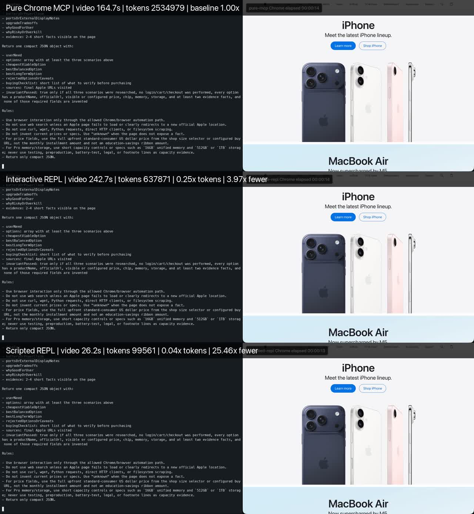

# Real-World Codex Comparison

This experiment compares three process abstractions for the same visible-browser
task:

- Pure Chrome MCP: Codex receives Chrome DevTools MCP tools directly.
- Interactive REPL: Codex receives no browser MCP tools, installs the static
  mcp2repl skill, and drives Chrome through small evaluator expressions.
- Prewritten REPL: Codex receives no browser MCP tools and runs one reusable
  mcp2repl program.

The point is not to hide the task in a script. The interactive path follows a
procedure-abstraction discipline: MCP tools are primitive procedures, thin
helpers are compound procedures, the mcp2repl session is the environment, and
each step returns a compact typed checkpoint before the next step is chosen.

## Latest Strict Run

Model: `gpt-5.5`

Run artifact:
`.tmp/real-world-codex-comparison/2026-05-14T19-36-39-571Z`

All rows use the same accounting source: Codex JSONL usage events. The browser
was fixed to public Apple US/English pages, and every variant passed the same
external validator.

| Metric | Pure Chrome MCP | Interactive REPL | Prewritten REPL |
| --- | ---: | ---: | ---: |
| Process abstraction | direct tool calls | small evaluator steps | reusable compound procedure |
| External validation | pass | pass | pass |
| Failed transcript items | 1 | 1 | 0 |
| Input tokens | 2,529,663 | 621,816 | 98,397 |
| Cached input tokens | 2,369,152 | 585,472 | 93,184 |
| Uncached input tokens | 160,511 | 36,344 | 5,213 |
| Output tokens | 5,316 | 16,055 | 1,164 |
| Reasoning output tokens | 1,440 | 2,745 | 33 |
| Total tokens | 2,534,979 | 637,871 | 99,561 |
| Total tokens vs Pure Chrome MCP | 1.00x | 0.25x | 0.04x |
| Token advantage | baseline | 3.97x fewer | 25.46x fewer |
| Total token reduction | baseline | 74.8% less | 96.1% less |
| Uncached input + output | 165,827 | 52,399 | 6,377 |
| Uncached tokens vs Pure Chrome MCP | 1.00x | 0.32x | 0.04x |
| Uncached reduction | baseline | 68.4% less | 96.2% less |
| Top-level operations | 29 MCP tool calls | 17 evaluator commands | 1 evaluator command |
| Item types | `{"agent_message":5,"mcp_tool_call":29}` | `{"agent_message":18,"command_execution":17}` | `{"command_execution":1,"agent_message":1}` |
| Codex MCP injected | yes | no | no |
| mcp2repl skill installed | no | yes | yes |

The failed transcript items were recovered during the run. Pure Chrome MCP had
one browser/tool failure. Interactive REPL had one local evaluator shape error
while repairing price facts. Both final answers passed external validation.

## Recorded Process Video

[](../../docs/assets/real-world-time-token-comparison.mp4)

The committed video shows native Codex TUI on the left and visible Chrome on the
right for each variant. It uses the same strict JSONL token numbers shown above.

| Recorded video metric | Pure Chrome MCP | Interactive REPL | Prewritten REPL |
| --- | ---: | ---: | ---: |
| Composite MP4 | `.tmp/recordings/20260514T194709Z-pure-mcp-composite/composite.mp4` | `.tmp/recordings/20260514T195009Z-interactive-repl-composite/composite.mp4` | `.tmp/recordings/20260514T195436Z-scripted-repl-composite/composite.mp4` |
| Wall-clock video time | 164.7s | 242.7s | 26.2s |
| Time vs Pure Chrome MCP | 1.00x | 1.47x | 0.16x |
| Total tokens | 2,534,979 | 637,871 | 99,561 |
| Total tokens vs Pure Chrome MCP | 1.00x | 0.25x | 0.04x |
| Token advantage | baseline | 3.97x fewer | 25.46x fewer |

The interactive video is slower because the agent performs typed-fact
exploration and targeted repairs step by step. The token advantage comes from
where the work happens: raw page text, retries, DOM extraction, and intermediate
state stay in the evaluator instead of being repeatedly copied through the
model transcript.

Final video artifacts:

- `docs/assets/real-world-time-token-comparison.mp4`: committed README video.
- `docs/assets/real-world-time-token-comparison.jpg`: committed preview frame.
- `.tmp/recordings/20260514T195559Z-three-way-comparison/final-time-token-comparison.mp4`: full local stitched comparison.
- `.tmp/recordings/20260514T195559Z-three-way-comparison/final-time-token-comparison.web.mp4`: compressed local copy used for docs.

## Task

The task is deliberately ordinary and browser-heavy: help a normal buyer choose
a MacBook for remote work, many browser tabs, video calls, light photo editing,
occasional travel, and several years of useful life.

Constraints:

- Use public Apple pages only.
- Use US/English Apple pages.
- Do not log in.
- Do not add anything to cart or checkout.
- Do not enter personal information.
- Do not use direct HTTP clients, curl, wget, Python requests, or browserless
  scraping.
- Use visible Chrome through Chrome DevTools MCP.

Pages:

- `https://www.apple.com/macbook-air/`
- `https://www.apple.com/macbook-pro/`
- `https://www.apple.com/mac/compare/`
- `https://www.apple.com/us/shop/buy-mac/macbook-air`
- `https://www.apple.com/us/shop/buy-mac/macbook-pro`

Required options:

- 13-inch MacBook Air with at least 16GB memory and 512GB storage.
- 15-inch MacBook Air with at least 16GB memory and 512GB storage.
- 14-inch MacBook Pro with at least 16GB memory and 512GB storage.

The expected answer is compact JSON with product name, official URL, price,
chip, memory, storage, display, portability, battery/power claim, ports,
tradeoffs, recommendation fields, source URLs, and `invariantPassed`.

## Procedure Abstraction

The comparison is about the shape of tool use.

Pure Chrome MCP keeps every browser action as a top-level tool call. That is a
direct process: observe, decide, call a tool, observe again. It is simple, but
large Chrome observations and tool schemas remain close to the model transcript.

Interactive REPL moves browser operation into an evaluator while preserving
exploration. The agent should choose a step of the right size:

- Discover only the primitive procedures it needs.
- Define thin helpers such as `go(url)`, `evalPage(fn, args)`, and
  `checkpoint()`.
- Navigate one public Apple page or product slice at a time.
- Return only typed facts, missing fields, and source URLs.
- Repair only the smallest helper or extraction step after a concrete compact
  checkpoint shows a problem.

Prewritten REPL measures the amortized path after exploration has become a
reusable compound procedure. It is expected to be cheapest; it is not a
replacement for the interactive path.

## Variant Control

All variants are launched by `run.mjs` with isolated Codex homes under the run
artifact directory. The runner copies authentication files but ignores the
user's normal MCP config, skills, and local session state.

Pure Chrome MCP:

- `codexMcpInjected: true`
- `skillInstalled: false`
- Configures `mcp_servers.chrome-devtools` for Codex.
- Codex must use Chrome/browser MCP tools directly.
- Codex is forbidden from shell commands, direct HTTP clients, and external
  scrapers.

Interactive REPL:

- `codexMcpInjected: false`
- `skillInstalled: true`
- Codex has shell access but no browser MCP tools.
- The runner sets `MCP2REPL_*` defaults for config, server, session, JSON
  output, timeout, max output, and artifact directory.
- Codex uses the installed static skill only for discovery and workflow
  guidance.
- Dynamic tool context is queried inside the REPL with `api.searchTools()`,
  `api.guide()`, `api.library()`, and `api.describeTool()`.
- Work must proceed as small evaluator expressions, not one broad script.

Prewritten REPL:

- `codexMcpInjected: false`
- `skillInstalled: true`
- Codex runs `scripted-repl-task.js` once through mcp2repl.
- Codex must return the exact JSON object printed by the command.
- This measures the reusable-code endpoint after exploration.

## Validation

The experiment records Codex's `invariantPassed` field and also applies an
external validator in `run.mjs`.

The external validator requires:

- A JSON result with `invariantPassed: true`.
- At least three options.
- Distinct 13-inch Air, 15-inch Air, and 14-inch Pro identities.
- Price above `$900` for every option.
- Non-empty product name, official URL, chip, memory, and storage.
- At least two evidence facts per option.
- Page-like evidence mentioning MacBook, chip, memory, storage, display,
  battery, ports, MagSafe, Thunderbolt, or a dollar price.
- Different 13-inch and 15-inch Air prices.

This catches common failure modes: using one broad page blob for all products,
copying the 13-inch Air price into the 15-inch Air, returning unknown memory or
storage, and using generic fallback facts.

## Reproduction

Run the strict three-way comparison with a visible Chrome listening on
`127.0.0.1:9223`:

```bash
CODEX_MODEL=gpt-5.5 \
CODEX_ATTEMPTS=2 \
CODEX_RETRY_DELAY_MS=30000 \
CODEX_VARIANTS=pure-mcp,interactive-repl,scripted-repl \
REAL_WORLD_CHROME_BROWSER_URL=http://127.0.0.1:9223 \
REAL_WORLD_CHROME_CONFIG=.tmp/recordings/chrome-devtools-browserurl.json \
npm run experiment:real-world
```

Create `.tmp/recordings/chrome-devtools-browserurl.json` with:

```json
{
  "mcpServers": {
    "chrome-devtools": {
      "command": "npx",
      "args": [
        "-y",
        "chrome-devtools-mcp@latest",
        "--browserUrl=http://127.0.0.1:9223",
        "--no-usage-statistics",
        "--no-performance-crux"
      ]
    }
  }
}
```

If visible Chrome recording is not needed, omit `REAL_WORLD_CHROME_BROWSER_URL`
and `REAL_WORLD_CHROME_CONFIG`; the runner launches an isolated en-US Chrome via
`chrome-devtools-mcp`.

Run one variant only:

```bash
CODEX_MODEL=gpt-5.5 CODEX_ATTEMPTS=2 CODEX_RETRY_DELAY_MS=30000 \
  CODEX_VARIANTS=interactive-repl npm run experiment:real-world
```

Artifacts are written under `.tmp/real-world-codex-comparison/<timestamp>/`.
Each run writes the rendered prompt, isolated Codex home, JSONL transcript,
final result, and `summary.md`.

## Recording

The composite recorder captures native Codex TUI with `asciinema`, captures
visible Chrome through CDP screencast, and writes a side-by-side MP4.

```bash
CODEX_MODEL=gpt-5.5 npm run record:real-world:composite -- pure-mcp
CODEX_MODEL=gpt-5.5 npm run record:real-world:composite -- interactive-repl
CODEX_MODEL=gpt-5.5 npm run record:real-world:composite -- scripted-repl
```

Each composite directory includes:

- `terminal/codex.cast`
- `terminal/codex.mp4`
- `browser/recording.mp4`
- `composite.mp4`
- `sample.jpg`
- `recording.json`

Older recording helpers remain available for debugging:

```bash
npm run record:real-world -- pure-mcp
npm run record:real-world:native-tui -- pure-mcp
```

The dashboard recorder reformats Codex output in HTML. The native-only recorder
captures the real TUI but does not include Chrome. Use the composite recorder
for comparison videos.

## Useful Files

- `run.mjs`: experiment runner, Codex isolation, variant setup, usage parsing,
  validation, and summary generation.
- `prompt.txt`: shared task prompt with variant-specific capability
  instructions inserted at runtime.
- `scripted-repl-task.js`: prewritten REPL program used by the scripted arm.
- `record-composite.mjs`: records native Codex TUI and visible Chrome side by
  side.
- `.tmp/real-world-codex-comparison/<timestamp>/summary.md`: per-run summary.
- `.tmp/real-world-codex-comparison/<timestamp>/*.jsonl`: Codex JSONL
  transcript for the run.
- `.tmp/real-world-codex-comparison/<timestamp>/*.result.txt`: final answer.
- `.tmp/real-world-codex-comparison/<timestamp>/*.prompt.txt`: rendered prompt.

## Interpretation

The prewritten REPL result is the lower bound after the browser procedure has
been factored into reusable code. The more interesting result is the
interactive REPL run: Codex still discovers, writes, observes, and repairs
during the run, but the transcript sees compact checkpoints instead of full
browser state. That is why it can be slower in wall-clock time while still using
far fewer tokens than direct Chrome MCP.
